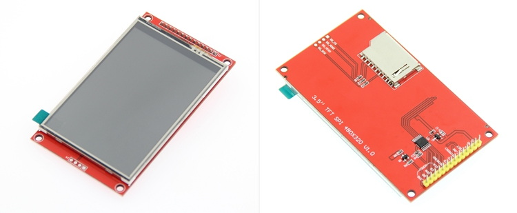
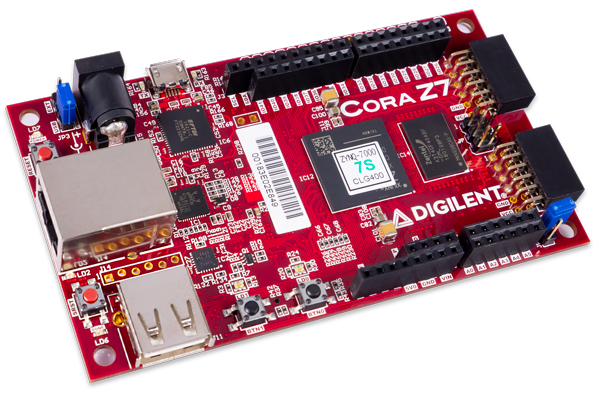

# Tutorial: TFT SPI display on Xilinx Zynq-7000 SoC

:construction: :construction: :construction: :construction: :construction: **UNDER CONSTRUCTION** :construction: :construction: :construction: :construction: :construction: 

This tutorial describes how to use a TFT SPI display on the AMD Xilinx Zynq-7000 SoC platform.

## Hardware

We will use the [3.5&Prime; TFT SPI ILI9488](http://www.lcdwiki.com/3.5inch_SPI_Module_ILI9488_SKU:MSP3520) 480x320 pixels display (which can be purchased on [Amazon](https://www.amazon.com/Hosyond-Display-Compatible-Mega2560-Development/dp/B0BWJHK4M6/ref=sr_1_1?crid=1JH7HIUGZU29J&keywords=3%2C5%22%2B480x320%2BSPI%2BTFT%2BILI9488&qid=1691653179&sprefix=3%2C5%2B480x320%2Bspi%2Btft%2Bili9488%2Caps%2C212&sr=8-1&th=1) or on [AliExpress](https://www.aliexpress.com/item/32995839609.html); I'm not affiliated in any way).  
The reasons for selecting this particular display are simple: I like its size (it is not too small nor too big), and I prepared a library for it. :smiley:

As a representative of the AMD Xilinx Zynq-7000 SoC platform, we will use the [Digilent Cora Z7](https://digilent.com/shop/cora-z7-zynq-7000-single-core-for-arm-fpga-soc-development/) development board.  
It's a nice small-factor, low-cost Zynq-7000 SoC board with excellent documentation and good board files available for Xilinx Vivado. It comes with a 667 MHz single-core Cortex-A9 processor with integrated programmable logic equivalent to Artix A7 FPGA and 512 MB of DDR3 memory. It is not the most powerful Zynq board, but it is more than adequate for the standalone single-thread application we will build in this project.

tbed